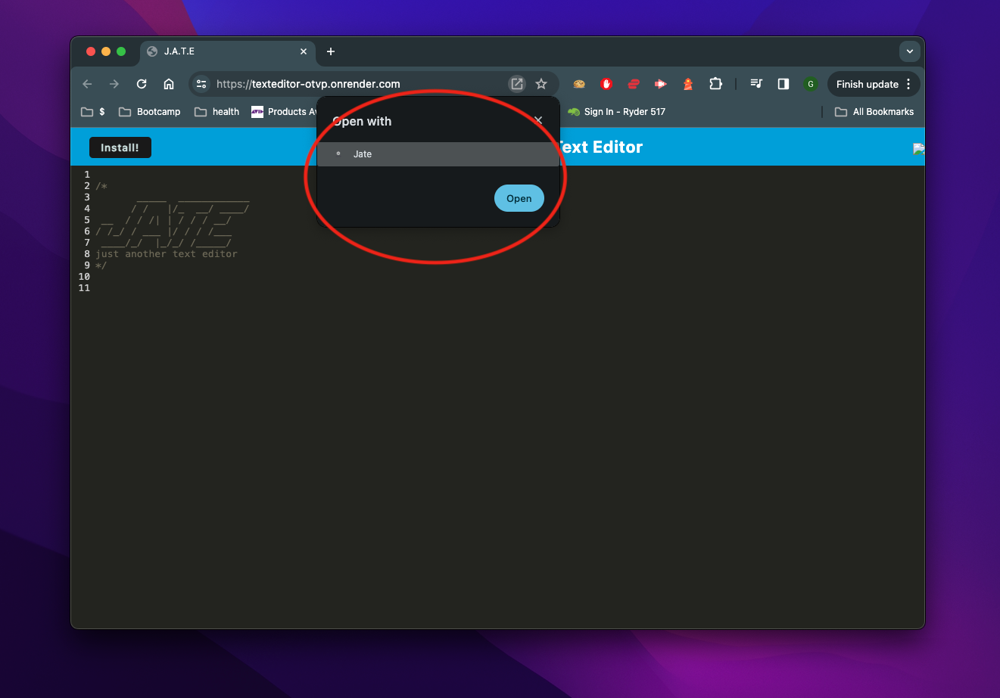

# textEditor

## Description

text editor using IndexedDB, can be installed as PWA 

## Usage

add text using the keyboard and mouse.
close the window and come back later, the notes will persist.

bug causes page to persist on reload if you click literally anything outside the note taker window on both the live app and the downloaded version 

## Installation

click here and accept the prompt in your browser to start taking notes locally

Click here to back back to your browser

## Credits

EdX Bootcamp tutor Rene Trevino 3/25/2024

## Liscence

MIT Liscence

Copyright (c) 2023 Garrett Lieb

Permission is hereby granted, free of charge, to any person obtaining a copy of this software and associated documentation files (the "Software"), to deal in the Software without restriction, including without limitation the rights to use, copy, modify, merge, publish, distribute, sublicense, and/or sell copies of the Software, and to permit persons to whom the Software is furnished to do so, subject to the following conditions:

The above copyright notice and this permission notice shall be included in all copies or substantial portions of the Software.

THE SOFTWARE IS PROVIDED "AS IS", WITHOUT WARRANTY OF ANY KIND, EXPRESS OR IMPLIED, INCLUDING BUT NOT LIMITED TO THE WARRANTIES OF MERCHANTABILITY, FITNESS FOR A PARTICULAR PURPOSE AND NONINFRINGEMENT. IN NO EVENT SHALL THE AUTHORS OR COPYRIGHT HOLDERS BE LIABLE FOR ANY CLAIM, DAMAGES OR OTHER LIABILITY, WHETHER IN AN ACTION OF CONTRACT, TORT OR OTHERWISE, ARISING FROM, OUT OF OR IN CONNECTION WITH THE SOFTWARE OR THE USE OR OTHER DEALINGS IN THE SOFTWARE.
